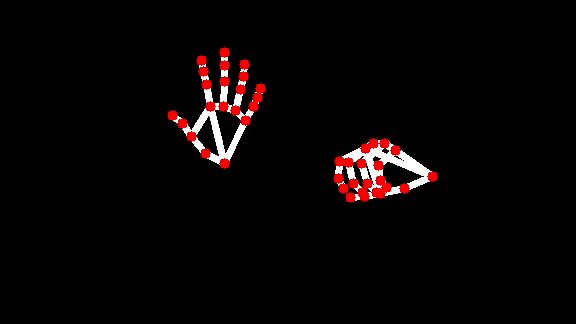
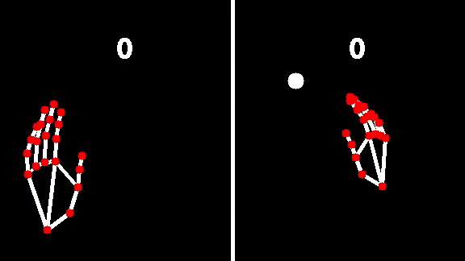

# Computer Vision (CV) Pong
CV Pong is a recreation of the classic game 'Pong' on the OpenCV platform. CV Pong seeks to use hand tracking to replace the classic paddles in Pong and bring a new level of interaction to the player. CV Pong leverages the OpenCV library and pre-trained MediaPipe models to perform hand tracking. CV Pong represents a fun and interesting experiment into the application of computer vision to Human-Computer Interaction (HCI).

## Project Features
- Hand tracking for two hands (players) using the MediaPipe Landmarker model
- Draws a virtual hand skeleton based on landmark data from the computer vision system
- Optimized for continuous tracking of fast hand movements 
- Maintains relatively high landmark accuracy confidence throughout various hand/finger movements
- Accurate hand-ball collision detection using hand skeleton and landmarks
- Closely simulates original Pong ball physics and interaction
- Implements classic Pong game mechanics

## Examples
### Single-hand landmark detection and skeleton drawing
- Demonstrates tracking of a single hand throughout compound movements
- Successfully draws tracking landmarks and hand skeleton based on data from the model

### Two-hand landmark detection and skeleton drawing
- Adds increased complexity to the case in the form of another hand
- Tracks both hands through various fast compound movements
- Draws landmarks and skeletons of both opposing hands
  

### Two-player game condition hand tracking
- Simulates game conditions and complexity by tracking two hands from two different people
- Demonstrates ability to draw graphics on various backgrounds

### Full gameplay
- Combines previously mentioned abilities into full-fledged gameplay level tracking
- Interacts as expected with Pong game mechanics, logic, and physics
  

